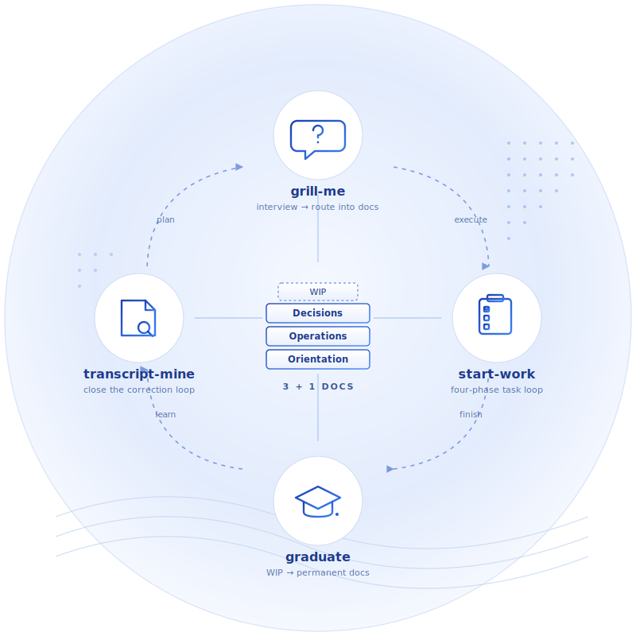

# claude-skills-3plus1

Personal [Claude Code](https://claude.com/claude-code) skills built around the **3+1 documentation framework**.

The premise: most engineering knowledge is never published, because the act of writing it up is too expensive. If documentation lives in a shape that *both* humans and agents can read, write, and keep current, that cost collapses. These four skills are the operational loop I use to make that real.

Framework reference: [LinkedIn — "Most engineering knowledge is never published"](https://www.linkedin.com/feed/update/urn:li:share:7431585543827668992).

---

## The 3+1 framework, in one screen

| Bucket | Lives in | Holds |
|---|---|---|
| **Orientation** (persistent) | `CLAUDE.md` + optional `LEXICON.md` + optional `CONTRACT.md` at project root | Scope, status, project map; canonical vocabulary; behavioural agreement with the agent |
| **Operations** (persistent) | `docs/operations/` | Runnable procedures with the reference data they need, one topic per file |
| **Decisions** (persistent) | `docs/decisions/` | ADRs / design docs / post-mortems; why a choice was made; append-only or supersede |
| **WIP** (transient) | task tracker (ergo / bd / GitHub Issues / `docs/wip/`) | Hypotheses, investigations, deferred questions — graduate or drop when resolved |

`LEXICON.md` and `CONTRACT.md` are **lazy** — they appear when there is something to write, not before.

---

## The four skills and how they compose

<p align="center">
  
</p>

Four skills, one loop, one shared substrate: a project's 3+1 docs. **`grill-me`** seeds the docs by interviewing you; **`start-work`** drives the WIP layer while you execute; **`graduate`** promotes finished WIP into permanent Operations / Decisions; **`transcript-mine`** scans past sessions for recurring corrections and feeds them back into `CONTRACT.md` / `CLAUDE.md`, so the next plan starts with a sharper agent.

### `grill-me` — interview, then route

Adapted from Matt Pocock's [`grill-with-docs`](https://github.com/mattpocock). Interviews you one question at a time about a plan or design, and routes every resolution into the right bucket: glossary terms into `LEXICON.md`, agent-behaviour rules into `CONTRACT.md`, procedures into Operations, costly-to-reverse choices into Decisions, deferred questions into WIP. The added layer over `grill-with-docs` is **`CONTRACT.md`** — the working agreement with the agent itself (proactivity radius, batch protocol, ask-first gates, skill auto-trigger policy).

### `start-work` — work the WIP layer

Four phases on whichever tracker the project uses (ergo, beads, GitHub Issues, plain WIP files, ad-hoc):

- **start work / kick off** — gather context, plan, set up the tracking artifact
- **continue / resume** — recall the in-flight task after a clean session
- **proceed / let's go** — execute the existing plan autonomously until a fork or blocker
- **checkpoint / snapshot** — persist progress before session context is lost

Detects the tracker convention from `CLAUDE.md`; does not invent one.

### `graduate` — promote WIP into permanent docs

When a tracked task is verifiably done, move the durable knowledge into Operations / Decisions and close the tracking artifact **cleanly** — no stub, no cross-reference. Prefers updating an existing doc over creating a new one. Strips WIP-flavoured language ("we investigated whether…") and rewrites in fact mode.

This is the bridge from the transient bucket to the persistent ones. Without `graduate`, the WIP layer accretes and the docs surface stays empty.

### `transcript-mine` — close the correction loop

Eugene Yan's *compounding-loop* practice for Claude Code. Scans recent transcripts for recurring user-correction patterns ("stop doing X", "you forgot Y", "still wrong"), surfaces the top clusters with hit counts, and proposes config updates. Operates locally on `~/.claude/projects/*/*.jsonl`; nothing leaves the machine.

Without this, every correction is forgotten next session. With it, corrections compound — usually into a new `CONTRACT.md` clause or a `CLAUDE.md` line, which means the loop closes inside the 3+1 framework rather than outside it.

Each skill writes to a layer the next one reads. Skip any of them and the loop leaks: skip `grill-me` and docs stay tacit; skip `graduate` and WIP rots; skip `transcript-mine` and the same correction repeats every session.

---

## From docs to graders — runnable example

The four skills keep the substrate alive; the next step is making the harness **execute** it. [`examples/verification-harness/`](examples/verification-harness/) is a self-contained mini-project (clean 3+1 layout, runnable in five minutes) that wires:

- a severity-tagged conventions doc as the **rubric**,
- a `/review` skill that grades manifest diffs against it,
- a **PreToolUse hook** that deterministically blocks `git push` until the grade is fresh — "always before X" belongs in a hook, not in a CLAUDE.md sentence,
- a **golden set** of violations replayed through headless `claude -p` (`make replay` → catch-rate), so the grader is calibrated, not decorative,
- a `/checkpoint` write-back step that turns session failures into new rules + fixtures.

The point it demonstrates: in a mature 3+1 project the verification knowledge is already written down — what's missing is the executor. See the example's `README.md` for the demo loop.

---

## Local telemetry — runnable example

The harness does the checking; [`examples/agent-telemetry/`](examples/agent-telemetry/) makes the loop **measurable**. An [agentsview](https://github.com/kenn-io/agentsview)-inspired stack at 1% of the weight — no server, no database, no dependencies:

- a **zero-LLM hook collector** logs work-loop events (start-work / checkpoint / push / MR / skill invocations) to JSONL as they happen,
- a **SessionEnd harvester** distills each transcript into one durable line (tokens deduped by message id, active time vs wall time, tool/model mix) before the ~30-day transcript rotation erases it,
- a **stdlib report generator** renders a console summary or a self-contained static HTML dashboard (light + dark).

Collection is transparent and controllable: everything is wired in one `.claude/settings.json`, collectors always exit 0 (telemetry can never block the agent), stores are local, gitignored, and disposable. `make seed && make html` shows the dashboard in under a minute with no real sessions.

---

## Install

Symlink the skills into your Claude Code skills directory:

```bash
git clone git@github.com:<you>/claude-skills-3plus1.git
cd claude-skills-3plus1

ln -s "$(pwd)/skills/grill-me"        ~/.claude/skills/grill-me
ln -s "$(pwd)/skills/start-work"      ~/.claude/skills/start-work
ln -s "$(pwd)/skills/graduate"        ~/.claude/skills/graduate
ln -s "$(pwd)/skills/transcript-mine" ~/.claude/skills/transcript-mine
```

Or copy if you prefer to detach from upstream.

Each skill is self-contained: a `SKILL.md` (the contract Claude Code reads) plus, where relevant, a `references/` sub-tree for longer protocols and a `scripts/` tree for executables.

---

## Project layout

```
claude-skills-3plus1/
├── README.md                    — this file
├── LICENSE
├── docs/
│   └── skills-loop.svg          — the diagram embedded in README
└── skills/
    ├── grill-me/
    │   └── SKILL.md
    ├── start-work/
    │   ├── SKILL.md
    │   └── references/          — per-phase protocols
    ├── graduate/
    │   └── SKILL.md
    └── transcript-mine/
        ├── SKILL.md
        ├── references/          — pattern interpretation, rule placement
        └── scripts/             — mine_transcripts.py + default patterns
```

---

## Status

Personal. Lightly polished for sharing, not productised. Conventions evolve in lockstep with my own use; expect breaking changes in `CONTRACT.md` shape and tracker detection as the framework matures.

Origin credits:
- `grill-me` — adapted from Matt Pocock's `grill-with-docs`.
- `transcript-mine` — implements Eugene Yan's *closing-the-loop* step from *How to Work and Compound with AI* (2026-05).
- 3+1 framework — mine, written up at the LinkedIn link above.
